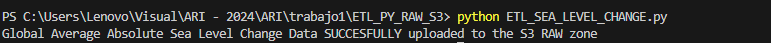

# Trabajo #1 Fuentes de datos, Ingesta y Datalake en AWS

## DATASETS
- [Climate Change Indicators](https://www.kaggle.com/datasets/tarunrm09/climate-change-indicators?select=climate_change_indicators.csv)
- [Climate Change Video Set / NASA](https://www.kaggle.com/datasets/brsdincer/climate-change-video-set-nasa)
- [Global Average Absolute Sea Level Change, 1880-2014](https://datahub.io/core/sea-level-rise#data)
- [Green Domain](https://www.thegreenwebfoundation.org/tools/green-web-dataset/)

## Ingesta de datos y Almacenamiento

La ingesta de los datos hacia la zona RAW del Data Lake fue realizada utilizando scripts de Python que descargaron datasets desde diferentes fuentes. Estos datos fueron posteriormente almacenados en la ruta S3 correspondiente a la zona RAW.

Fuentes de datos y ubicación en S3:
- climate_change_indicators_83cc632aa7b85365d4cd8a18b81dc435
    > Ubicación en S3: s3://climate-change-datalake/Raw/Climate-Change-Indicators/

- climate_change_videos
    > Ubicación en S3: s3://climate-change-datalake/Raw/Climate-change-videos/

- co2_emissions
    > Ubicación en S3: s3://climate-change-datalake/Raw/CO2-Emissions/

- sea_level_change
    > Ubicación en S3: s3://climate-change-datalake/Raw/Sea-level-change/

Para uno de los datasets, recibimos los datos en un archivo comprimido en formato ZIP, el cual contenía un archivo XML. Para poder trabajar con este archivo, descomprimimos y luego subimos a la zona RAW del data lake.

Con dos de los datasets, estos fueron descargado desde la plataforma Kaggle, para lo cual fue necesario agregar un token de autenticación debido a las restricciones de acceso a los datos.

### Almacenamiento

Todos los datos se almacenan en la zona RAW del Data Lake, ubicada en el bucket de S3:
 
> s3://climate-change-datalake/Raw/

## ETL

Creamos en Glue el crawler con las siguientes especificaciones

- especificaciones

Se hizo un proceso de limpieza editando algunos nombres de columnas en los diferentes datasets

Resultado

### ETLs AWS GLUE hacia zona RAW

