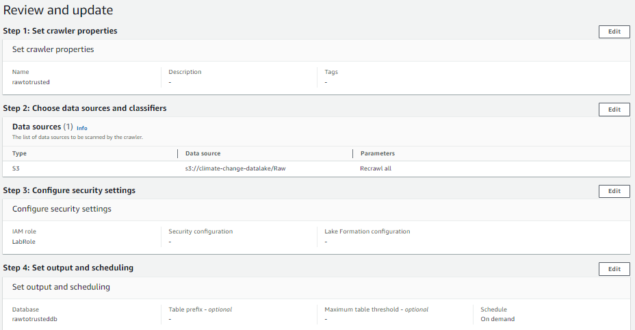

# Trabajo #1 Fuentes de datos, Ingesta y Datalake en AWS

## DATASETS
- [Climate Change Indicators](https://www.kaggle.com/datasets/tarunrm09/climate-change-indicators?select=climate_change_indicators.csv)
- [Climate Change Video Set / NASA](https://www.kaggle.com/datasets/brsdincer/climate-change-video-set-nasa)
- [Global Average Absolute Sea Level Change, 1880-2014](https://datahub.io/core/sea-level-rise#data)
- [CO2 Emissions](https://data.worldbank.org/indicator/EN.ATM.CO2E.PC)

## Ingesta de datos y Almacenamiento

La ingesta de los datos hacia la zona RAW del Data Lake fue realizada utilizando scripts de Python que descargaron datasets desde diferentes fuentes. Estos datos fueron posteriormente almacenados en la ruta S3 correspondiente a la zona RAW.

**Fuentes de datos y ubicación en S3:**
- climate_change_indicators_83cc632aa7b85365d4cd8a18b81dc435
    > **Ubicación en S3:** s3://climate-change-datalake/Raw/Climate-Change-Indicators/

- climate_change_videos
    > **Ubicación en S3:** s3://climate-change-datalake/Raw/Climate-change-videos/

- co2_emissions
    > **Ubicación en S3:** s3://climate-change-datalake/Raw/CO2-Emissions/

- sea_level_change
    > **Ubicación en S3:** s3://climate-change-datalake/Raw/Sea-level-change/

Para uno de los datasets, recibimos los datos en un archivo comprimido en formato ZIP, el cual contenía un archivo XML. Para poder trabajar con este archivo, descomprimimos y luego subimos a la zona RAW del data lake.

En la creacion de la tabla se veia un formato UNKNOWN por lo que en el script de python decidimos extraer los datos y convertirlos en formato csv 

Con dos de los datasets, estos fueron descargado desde la plataforma Kaggle, para lo cual fue necesario agregar un token de autenticación debido a las restricciones de acceso a los datos.

### Almacenamiento

Todos los datos se almacenan en la zona RAW del Data Lake, ubicada en el bucket de S3:
 
> s3://climate-change-datalake/Raw/

## ETL

### AWS Crawler

Creamos en AWS Glue Crawler con las siguientes especificaciones

Se hizo un proceso de limpieza manual editando algunos nombres de columnas en los diferentes datasets

Resultado

### ETL AWS GLUE hacia zona Trusted

Luego tener correctamente los datos en la zona RAW, construimos y ejecutamos los scripts necesarios en la seccion de ETL JOBS. 

**Especificaciones:**
- Nombre del ETL JOBS: rawtotrusted
- AM Role: LabRole
- Type: Spark
- Glue version: Glue 4.0 - Supports spark 3.3, Scala 2, Python 3
- Language: Python 3
- Worker type: G 1X

Se corrieron los respectivos Scripts [Trabajo1\AWS ETL GLUE TRUSTED], su status para cada dataset termino en Succeeded y luego de esto en nuestra base de datos se crean la siguientes Tables

>[!IMPORTANT]
>En el contexto de este proyecto, se tomó la decisión inicial de trabajar con datos no estructurados, como archivos de video, para capturar diversas fuentes de información sobre el cambio climático. Sin embargo, después de evaluar las complejidades inherentes al manejo de este tipo de datos, se ha decidido proceder con datos estructurados en formato CSV por las diferentes razones.

## AWS EMR - Apache Spark

## Consultas 

### AWS Athena