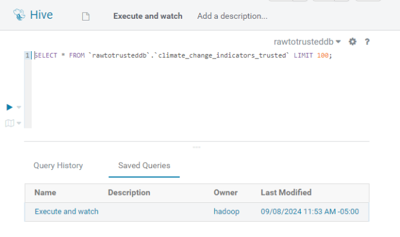
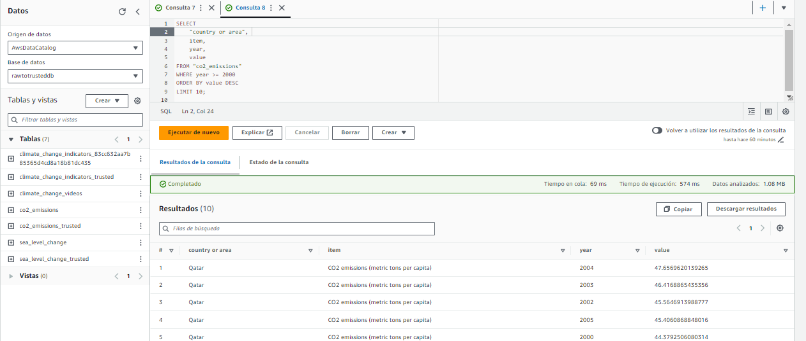

# Trabajo #1 Fuentes de datos, Ingesta y Datalake en AWS, Procesamiento 

## Datos del estudiante (s).
- Maria José Gutiérrez Estrada. ***mjgutierre@eafit.edu.co***
- Mariana Vasquez Escobar.
 ***mvasqueze@eafit.edu.co***

## Estructura del Proyecto. 

```
├───Proyecto Integrador
└───Trabajo1
    ├───AWS ETL GLUE RAW
    ├───AWS ETL GLUE TRUSTED
    ├───CONSULTAS
    │   ├───Athena
    │   ├───Hive
    │   └───Redshift
    ├───Datasets
    │   └───Raw
    │       ├───Climate-change-indicators
    │       ├───Climate-change-videos
    │       ├───Green-domain
    │       └───Sea-level-change
    ├───Img
    └───NOTEBOOKS
```

## 1. Fuentes de Datos y Preparación

### Identificación de Fuentes

Se comenzaron a buscar datasets relacionados con el cambio climático y el calentamiento global en diferentes niveles (local, nacional e internacional). Las fuentes seleccionadas fueron:

- **Climate Change Indicators *(Datos estructurados)*:** [Kaggle Dataset](https://www.kaggle.com/datasets/tarunrm09/climate-change-indicators?select=climate_change_indicators.csv)
- **Climate Change Video Set / NASA *(Datos No Estructurados)*:** [Kaggle Dataset](https://www.kaggle.com/datasets/brsdincer/climate-change-video-set-nasa)
- **Global Average Absolute Sea Level Change, 1880-2014 *(Datos Estructurados)*:** [DataHub Dataset](https://datahub.io/core/sea-level-rise#data)
- **CO2 Emissions *(Datos Semi Estructurados)*:** [World Bank Dataset](https://data.worldbank.org/indicator/EN.ATM.CO2E.PC)

### Ingesta de Datos

La ingesta de los datos hacia la zona RAW del Data Lake fue automatizada utilizando scripts de Python que descargaron los datasets desde las diferentes fuentes. Estos datos fueron posteriormente almacenados en la ruta S3 correspondiente a la zona RAW.

#### Fuentes de Datos y Ubicación en S3

- **Climate Change Indicators:**
  - Ubicación en S3: `s3://climate-change-datalake/Raw/Climate-Change-Indicators/`
  
- **Climate Change Videos:**
  - Ubicación en S3: `s3://climate-change-datalake/Raw/Climate-change-videos/`

- **CO2 Emissions:**
  - Ubicación en S3: `s3://climate-change-datalake/Raw/CO2-Emissions/`

- **Sea Level Change:**
  - Ubicación en S3: `s3://climate-change-datalake/Raw/Sea-level-change/`

### Retos

- **Dataset CO2 Emissions:** 
  - Los datos estaban en un archivo comprimido en formato ZIP que contenía un archivo XML. Se descomprimió y luego se convirtió en formato CSV para su procesamiento.
  

- **Dataset Climate Change Indicators y Climate Change Videos:**
  - Estos datasets fueron descargados desde Kaggle, lo que requirió un token de autenticación debido a las restricciones de acceso a los datos.
  

## 2. Diseño del Data Lake

### Zonificación del Data Lake

Se definieron las siguientes zonas:

- **Raw:** Se almacenaron los datos originales tal como se descargaron.
- **Trusted:** Los datos fueron procesados y transformados para análisis.

### Almacenamiento

Los datos fueron organizados y almacenados en S3 siguiendo una estructura jerárquica:

```s3://climate-change-datalake/Raw/```


## 3. ETL con AWS Glue

Se usaron Glue Crawlers para catalogar los datos en la zona RAW, creando metadatos en el Data Catalog que permitieron el acceso a los datos desde Athena y Redshift.

### Crawler

Se creó un Crawler con las siguientes especificaciones:


## 4. ETL AWS Glue hacia Zona Trusted

Después de tener los datos correctamente en la zona RAW, se construyeron y ejecutaron los scripts de ETL en AWS Glue.

### Especificaciones del ETL Job

- **Nombre del ETL Job:** rawtotrusted
- **IAM Role:** LabRole
- **Tipo:** Spark
- **Versión de Glue:** Glue 4.0 (Soporta Spark 3.3, Scala 2, Python 3)
- **Lenguaje:** Python 3
- **Tipo de Trabajador:** G.1X

Los scripts ejecutados se pueden encontrar en el repositorio [GitHub](https://github.com/mvasqueze/ARI/tree/main/Trabajo1/AWS%20ETL%20GLUE%20TRUSTED), y su estatus para cada dataset terminó en "Succeeded". Luego de esto, se crearon las tablas correspondientes en nuestra base de datos.


> [!IMPORTANT]
> En el contexto de este proyecto, se tomó la decisión inicial de trabajar con datos no estructurados, como archivos de video, para capturar diversas fuentes de información sobre el cambio climático. Sin embargo, después de evaluar las complejidades al manejo de este tipo de datos, se ha decidido proceder con datos estructurados en formato CSV por esta razon.

## 5. AWS EMR para Procesamiento con Spark

### Creación del Clúster EMR

Se creó un clúster EMR utilizando las especificaciones recomendadas por el profesor durante la clase.


### Configuración de Conexiones

Se abrieron los puertos necesarios para la conexión con los servicios de **Jupyter**, **Hive**, **Hadoop**, entre otros:


### Acceso a Hadoop y Hive

- Se ingresó a **Hadoop** utilizando las credenciales proporcionadas por el docente.
- Se accedió a **Hive**, en la base de datos `rawtotrust`.


### Parcheo del HDFS

El sistema de archivos **HDFS** fue parcheado para habilitar el almacenamiento temporal en el clúster:


### Query en Hive

Dentro de la base de datos `trusted`, se ejecutaron varias consultas utilizando **Hive**. Una de las tablas exploradas fue la tabla **climate_change_indicators_trusted**.




También se realizó una consulta en la tabla **co2_emissions** para obtener datos relevantes sobre las emisiones de CO2.


### Query Cruzado en Hive 

Se realizó un query para taer el indicador de cambio climático en cada país representado por el cambio de tempratura junto con la emisión de c02 de cada país en el año 2003


## 6. Consultas y Modelado de Datos

### Athena

Una vez que los datos estuvieron catalogados, se usó Athena para realizar consultas SQL sobre los datos en S3. Aquí algunos ejemplos:

- **Consulta 1:** Recupera las emisiones de CO2 desde el año 2000, ordenadas de mayor a menor, y muestra los 10 registros más altos.
  ```sql
  SELECT 
      "country or area", 
      item, 
      year, 
      value
  FROM "co2_emissions"
  WHERE year >= 2000
  ORDER BY value DESC
  LIMIT 10;



- **Consulta 2:** Extrae datos sobre indicadores de temperatura específicos para Colombia para los años 1967, 1968, 1969, 1970, 2020, 2021 y 2022.

    ```sql
    SELECT 
        Country,
        ISO2,
        ISO3,
        Source,
        F1967,
        F1968,
        F1969,
        F1970,
        F2020,
        F2021,
        F2022
    FROM 
        "climate_change_indicators_83cc632aa7b85365d4cd8a18b81dc435"
    WHERE 
        Country = 'Colombia'
        AND Indicator LIKE '%Temperature%'  
    ORDER BY 
        Country ASC
    LIMIT 10;


- **Consulta 3:** Extrae datos sobre el nivel del mar ajustado por CSIRO y NOAA para el rango de años de 2000 a 2010, ordenados por año.


    ```sql
        SELECT 
            year AS Year,
            CAST(NULLIF("CSIRO - Adjusted sea level (inches)", '') AS DOUBLE) AS CSIRO_Adjusted_Sea_Level,
            CAST(NULLIF("CSIRO - Lower error bound (inches)", '') AS DOUBLE) AS CSIRO_Lower_Error_Bound,
            CAST(NULLIF("CSIRO - Upper error bound (inches)", '') AS DOUBLE) AS CSIRO_Upper_Error_Bound,
            CAST(NULLIF("NOAA - Adjusted sea level (inches)", '') AS DOUBLE) AS NOAA_Adjusted_Sea_Level
        FROM 
            "sea_level_change"
        WHERE 
            year BETWEEN '2000' AND '2010' 
        ORDER BY 
            year ASC
        LIMIT 10;


### Amazon Redshift

#### Creación del Cluster

Se creó un cluster de Amazon Redshift para almacenar y analizar los datasets de indicadores climáticos y emisiones de CO2:


#### Creación de Tablas Nativas

##### Climate Change Indicators

Una vez configurado el cluster, se accedió al **Query Editor** y se creó una tabla nativa a partir del dataset de **Climate change Indicators** del Laboratorio 1. Esto se realizó utilizando un notebook específico:

- **Notebook**: `Trabajo1\NOTEBOOKS\notebook_climate-indicators.ipynb`

Aquí se muestra el proceso en el Query Editor:


##### CO2 Emissions

Se realizó un proceso similar para el dataset de **CO2 Emissions**, creando otra tabla nativa. El notebook utilizado fue el siguiente:

- **Notebook**: `Trabajo1\NOTEBOOKS\notebook_co2.ipynb`

Una vez creada la segunda tabla nativa, se visualiza el siguiente resultado:


#### Consulta de Datos Cruzados

Después de construir ambas tablas (indicadores climáticos y emisiones de CO2), se realizó un **JOIN** para consultar los datos cruzados. Se enfocó en los registros correspondientes a **Colombia** y **EEUU** entre los años 2000 y 2020. El siguiente screenshot muestra el resultado de esta consulta:


### Clúster EMR

Se accedió a **Jupyter** a través del enlace habilitado en la consola del clúster EMR:


#### Inicialización de Spark

En un nuevo notebook, se inicializó **Spark** para comenzar con el procesamiento de datos:

- **Notebook**: `Trabajo1\NOTEBOOKS\jupyter-querys.ipynb`


#### Visualización de la Tabla `sea_level_trusted`

A continuación, se realizó una visualización de la tabla **sea_level_trusted**:


#### Query `CO2-emissions`

```sql
sql_query = """
    SELECT 
        t1.country AS country,
        t1.iso2 AS iso_code_2,
        t1.iso3 AS iso_code_3,
        t1.f2003 AS temperature_change_2003, 
        t2.value AS co2_emissions_2003
    FROM 
        rawtotrusteddb.climate_change_indicators_trusted t1
    JOIN 
        rawtotrusteddb.co2_emissions_trusted t2
        ON t1.country = t2.country_or_area#0
    WHERE 
        t2.year = 2003
"""

    result = spark.sql(sql_query)
    result.show(truncate=False)
 ```


> [!NOTE]
> Para evidenciar la congruencia entre las consultas de Hive y Jupyter-Spark, se realiza el mismo query entre Climate_change_indicators y co2_emissions que se hizo en hive


#### Query `Sea_Level_Change`

Finalmente se realizó un query sobre el dataset sea_level:


Resultado


