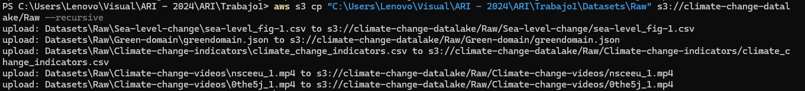

# Trabajo #1 Fuentes de datos, Ingesta y Datalake en AWS


## DATASETS
- [Climate Change Indicators](https://www.kaggle.com/datasets/tarunrm09/climate-change-indicators?select=climate_change_indicators.csv)
- [Climate Change Video Set / NASA](https://www.kaggle.com/datasets/brsdincer/climate-change-video-set-nasa)
- [Global Average Absolute Sea Level Change, 1880-2014](https://datahub.io/core/sea-level-rise#data)
- [Green Domain](https://www.thegreenwebfoundation.org/tools/green-web-dataset/)

## Ingesta de datos y Almacenamiento

La ingesta de datos se realizo por medio de aws cli

Usamos el comando aws s3 cp 

```
"C:\Users\Lenovo\Visual\ARI - 2024\ARI\Trabajo1\Datasets\Raw" s3://climate-change-datalake/Raw --recursive 
```

> el --recursive toma todos los archivos y carpetas a partir de /Raw




AWS


## ETL

